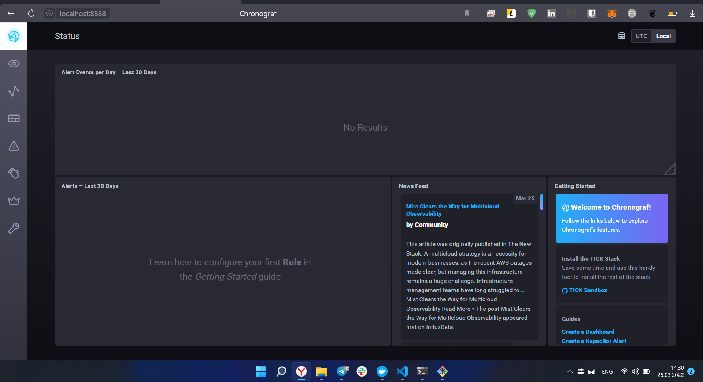
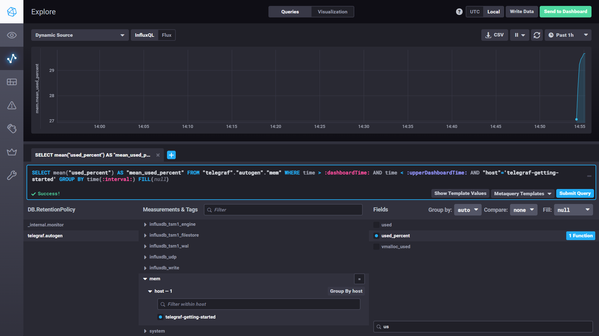
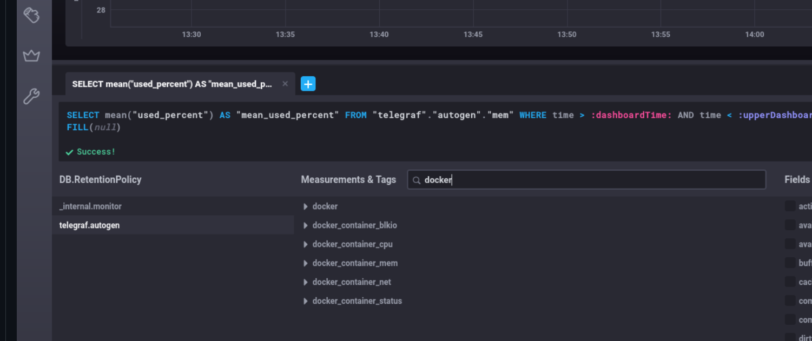

# Домашнее задание к занятию "10.02. Системы мониторинга"

> 1. Опишите основные плюсы и минусы pull и push систем мониторинга.

## Push

```
+ Настройка на агентах какие, куда и когда передавать данные (в т.ч. можно отправлять метрики в разные системы мониторинга).
+ Подходит для использования большого количества агентов с динамическими IP-адресами или с нестабильным сетевым соединением.
+ Менее высокие требования в центральному узлу, т.к. он только ожидает данные и не тратит ресурсы на опрос агентов.
+ скорость передачи данных (udp)

- Нужны агенты.
- Необходимость организации очередей входящих данных на центральном узле при большом количестве агентов.
- из-за udp не гарантирована достоверность данных,также данные могут потеряться
```

## Pull

```
+ Наличие агентов не обязательно.
+ Высокая достоверность данных (сервер запрашивает данные только с известных ему хостов, а не принимает все подряд).
+ удобство администрирования

- Высокая нагрузка на центральный узел, соответственно более высокие аппаратные требования.
- Единая точка отказа в виде центрального сервера.
- Необходимость знать актуальные адреса всех хостов, которых может быть очень много.
```

> 2. Какие из ниже перечисленных систем относятся к push модели, а какие к pull? А может есть гибридные?

* Prometheus - pull
* TICK - push
* Zabbix - push
* VictoriaMetrics - pull/push
* Nagios - pull/push

>3. Склонируйте себе репозиторий и запустите TICK-стэк, используя технологии docker и docker-compose.

В виде решения на это упражнение приведите выводы команд с вашего компьютера (виртуальной машины):

```
*   Trying 127.0.0.1:8888...
* TCP_NODELAY set
* Connected to localhost (127.0.0.1) port 8888 (#0)
> GET / HTTP/1.1
> Host: localhost:8888
> User-Agent: curl/7.68.0
> Accept: */*
>
* Mark bundle as not supporting multiuse
< HTTP/1.1 200 OK
< Accept-Ranges: bytes
< Cache-Control: public, max-age=3600
< Content-Length: 336
< Content-Security-Policy: script-src 'self'; object-src 'self'
< Content-Type: text/html; charset=utf-8
< Etag: "3362220244"
< Last-Modified: Tue, 22 Mar 2022 20:02:44 GMT
< Vary: Accept-Encoding
< X-Chronograf-Version: 1.9.4
< X-Content-Type-Options: nosniff
< X-Frame-Options: SAMEORIGIN
< X-Xss-Protection: 1; mode=block
< Date: Sat, 26 Mar 2022 09:41:16 GMT
<
* Connection #0 to host localhost left intact
<!DOCTYPE html><html><head><meta http-equiv="Content-type" content="text/html; charset=utf-8"><title>Chronograf</title><link rel="icon shortcut" href="/favicon.fa749080.ico"><link rel="stylesheet" href="/src.9cea3e4e.css"></head><body> <div id="react-root" data-basepath=""></div> <script src="/src.a969287c.js"></script> </body></html>


```

А также скриншот веб-интерфейса ПО chronograf (http://localhost:8888).



> Перейдите в веб-интерфейс Chronograf (http://localhost:8888) и откройте вкладку Data explorer.

> * Нажмите на кнопку Add a query
> * Изучите вывод интерфейса и выберите БД telegraf.autogen
> * В measurments выберите mem->host->telegraf_container_id , а в fields выберите used_percent. Внизу появится график утилизации оперативной памяти в контейнере telegraf.
> * Вверху вы можете увидеть запрос, аналогичный SQL-синтаксису. Поэкспериментируйте с запросом, попробуйте изменить группировку и интервал наблюдений.
> * Для выполнения задания приведите скриншот с отображением метрик утилизации места на диске (disk->host->telegraf_container_id) из веб-интерфейса.



> 5 .Изучите список telegraf inputs. Добавьте в конфигурацию telegraf следующий плагин - docker. После настройке перезапустите telegraf, обновите веб интерфейс и приведите скриншотом список measurments в веб-интерфейсе базы telegraf.autogen . Там должны появиться метрики, связанные с docker.

