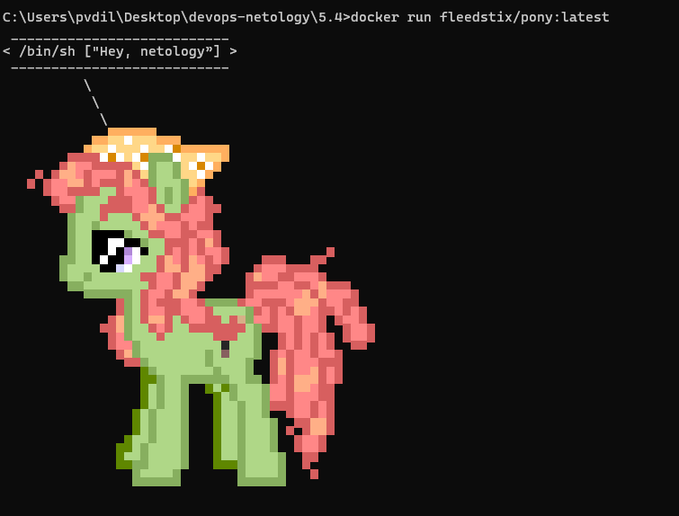
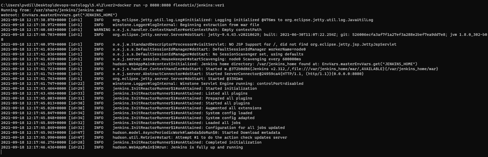
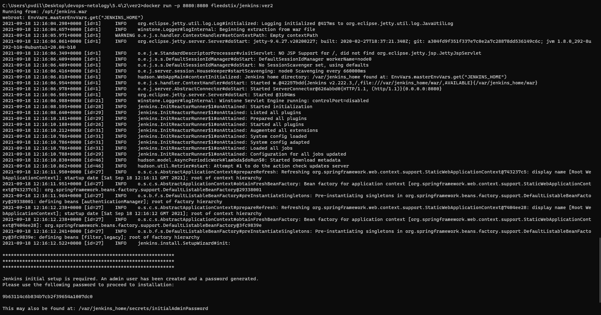
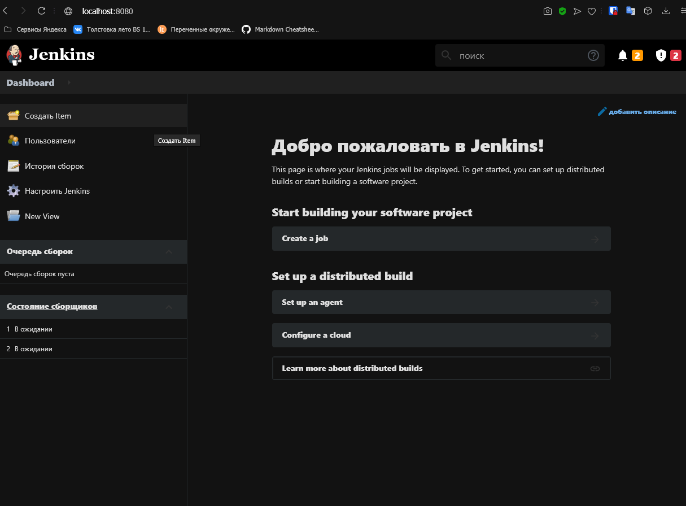
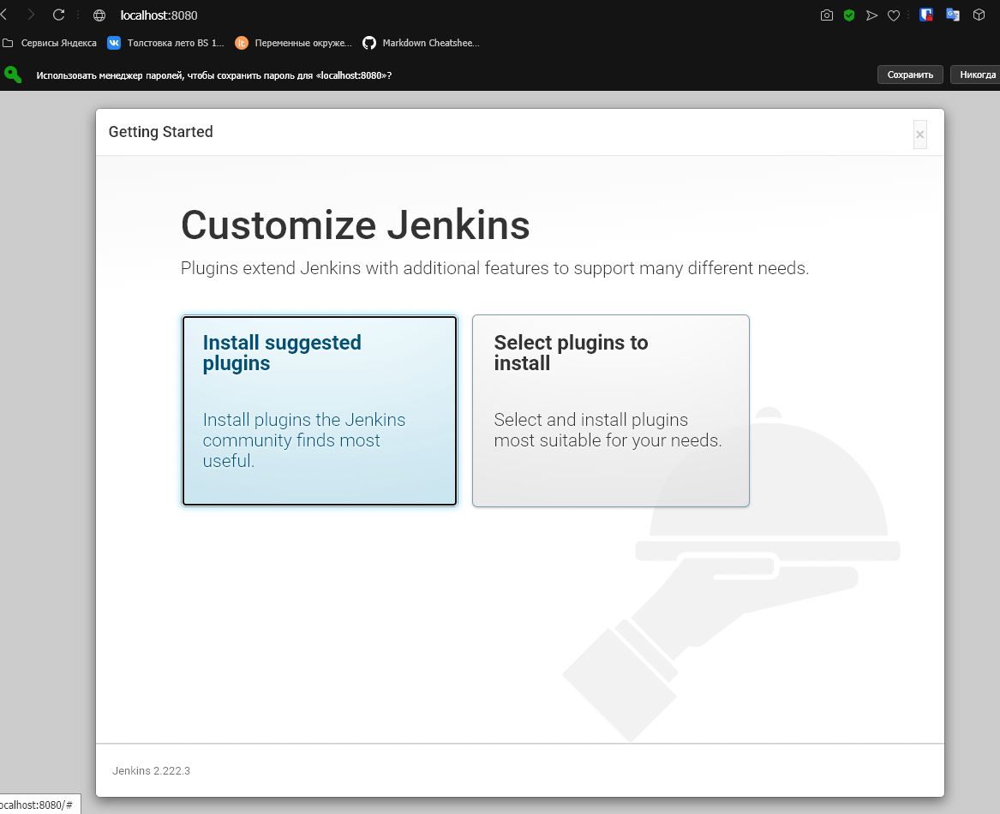
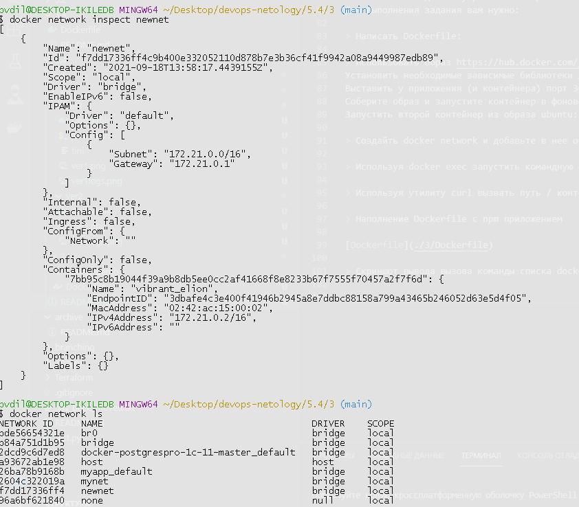

# Домашнее задание к занятию "5.4. Практические навыки работы с Docker"

> 1. В данном задании вы научитесь изменять существующие Dockerfile, адаптируя их под нужный инфраструктурный стек.

> Измените базовый образ предложенного Dockerfile на Arch Linux c сохранением его функциональности.
```
FROM ubuntu:latest

RUN apt-get update && \
    apt-get install -y software-properties-common && \
    add-apt-repository ppa:vincent-c/ponysay && \
    apt-get update
 
RUN apt-get install -y ponysay

ENTRYPOINT ["/usr/bin/ponysay"]
CMD ["Hey, netology”]
```
>  Для получения зачета, вам необходимо предоставить:
Написанный вами Dockerfile

[Dockerfile](./1/Dockerfile)

> Скриншот вывода командной строки после запуска контейнера из вашего базового образа



> Ссылку на образ в вашем хранилище docker-hub

https://hub.docker.com/repository/docker/fleedstix/pony

> 2. В данной задаче вы составите несколько разных Dockerfile для проекта Jenkins, опубликуем образ в dockerhub.io и посмотрим логи этих контейнеров.

> Составьте 2 Dockerfile:

> Общие моменты:

> Образ должен запускать Jenkins server

>Спецификация первого образа:
>Базовый образ - amazoncorreto
Присвоить образу тэг ver1

>Спецификация второго образа:
Базовый образ - ubuntu:latest
Присвоить образу тэг ver2

> Соберите 2 образа по полученным Dockerfile

> Запустите и проверьте их работоспособность

> Опубликуйте образы в своём dockerhub.io хранилище

Для получения зачета, вам необходимо предоставить:

> Наполнения 2х Dockerfile из задания:

[ver1](./2/ver1/Dockerfile)
[ver2](./2/ver2/Dockerfile)

> Скриншоты логов запущенных вами контейнеров (из командной строки)




> Скриншоты веб-интерфейса Jenkins запущенных вами контейнеров (достаточно 1 скриншота на контейнер)




> Ссылки на образы в вашем хранилище docker-hub

[ver1](https://hub.docker.com/layers/fleedstix/jenkins/ver1/images/sha256-fa058a45e801c8ca5f556989d8c9ef25bf0ecee2f2750e2676cbee6a238e7f96?context=repo)

[ver2](https://hub.docker.com/layers/fleedstix/jenkins/ver2/images/sha256-26654f72ad19025f3c74e19a83b4ff69e3be9fbd8835a9629031ffd43ceb6c23?context=explore)

> 3. В данном задании вы научитесь:

> объединять контейнеры в единую сеть
исполнять команды "изнутри" контейнера
Для выполнения задания вам нужно:

> Написать Dockerfile:

> Использовать образ https://hub.docker.com/_/node как базовый
Установить необходимые зависимые библиотеки для запуска npm приложения https://github.com/simplicitesoftware/nodejs-demo
Выставить у приложения (и контейнера) порт 3000 для прослушки входящих запросов
Соберите образ и запустите контейнер в фоновом режиме с публикацией порта
Запустить второй контейнер из образа ubuntu:latest

> Создайть docker network и добавьте в нее оба запущенных контейнера

> Используя docker exec запустить командную строку контейнера ubuntu в интерактивном режиме

> Используя утилиту curl вызвать путь / контейнера с npm приложением

> Наполнение Dockerfile с npm приложением

[Dockerfile](./3/Dockerfile)

> Скриншот вывода вызова команды списка docker сетей (docker network cli)



> Скриншот вызова утилиты curl с успешным ответом

