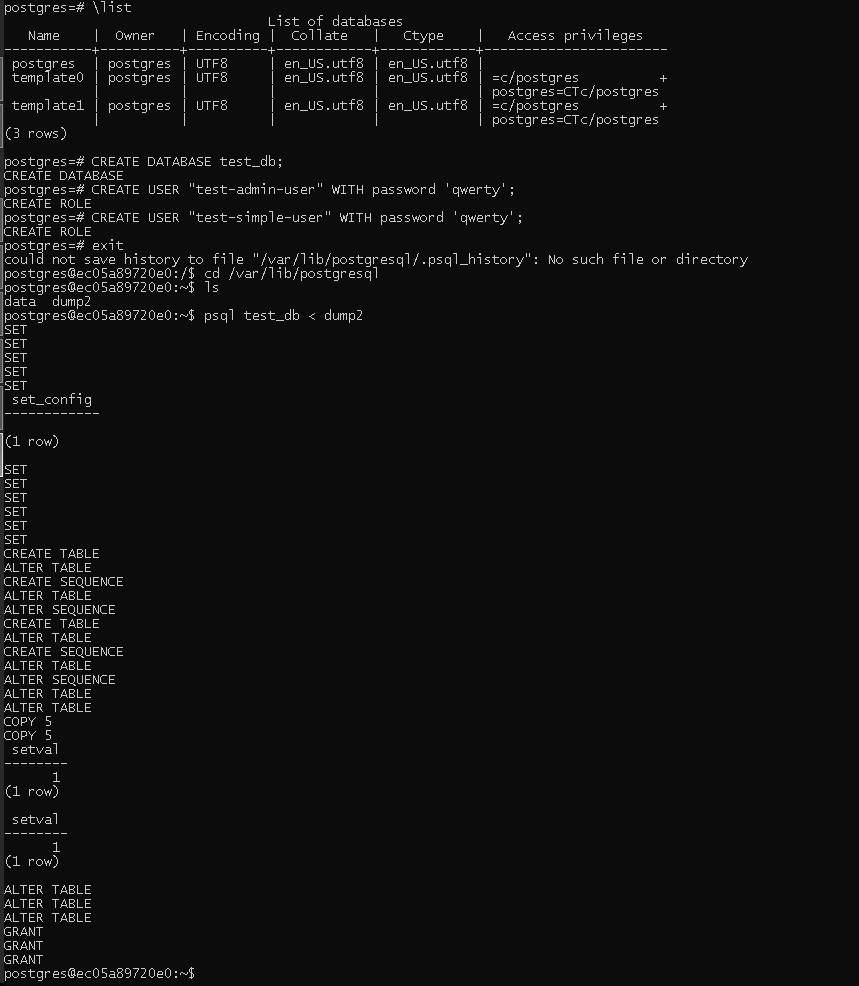
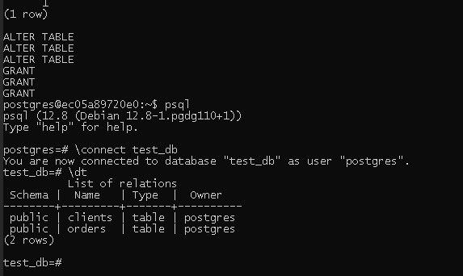

# Домашнее задание к занятию "6.2. SQL"

> 1. Используя docker поднимите инстанс PostgreSQL (версию 12) c 2 volume, в который будут складываться данные БД и бэкапы. Приведите получившуюся команду или docker-compose манифест.

[Docker-compose.yml](./1/docker-compose.yml)

> 2.
В БД из задачи 1:

* создайте пользователя test-admin-user и БД test_db
* в БД test_db создайте таблицу orders и clients (спeцификация таблиц ниже)
* предоставьте привилегии на все операции пользователю test-admin-user на таблицы БД test_db
* создайте пользователя test-simple-user
* предоставьте пользователю test-simple-user права на SELECT/INSERT/UPDATE/DELETE данных таблиц БД test_db

Таблица orders:

* id (serial primary key)
* наименование (string)
* цена (integer)

Таблица clients:

* id (serial primary key)
* фамилия (string)
* страна проживания (string, index)
* заказ (foreign key orders)

___

> Приведите:

> итоговый список БД после выполнения пунктов выше

```
postgres=# select * from pg_database;
  oid  |  datname  | datdba | encoding | datcollate |  datctype  | datistemplate | datallowconn | datconnlimit | datlastsysoid | datfrozenxid | datminmxid | dattablespace |               datacl
-------+-----------+--------+----------+------------+------------+---------------+--------------+--------------+---------------+--------------+------------+---------------+-------------------------------------
 13458 | postgres  |     10 |        6 | en_US.utf8 | en_US.utf8 | f             | t            |           -1 |         13457 |          480 |          1 |          1663 |
 16386 | test_db   |     10 |        6 | en_US.utf8 | en_US.utf8 | f             | t            |           -1 |         13457 |          480 |          1 |          1663 |
     1 | template1 |     10 |        6 | en_US.utf8 | en_US.utf8 | t             | t            |           -1 |         13457 |          480 |          1 |          1663 | {=c/postgres,postgres=CTc/postgres}
 13457 | template0 |     10 |        6 | en_US.utf8 | en_US.utf8 | t             | f            |           -1 |         13457 |          480 |          1 |          1663 | {=c/postgres,postgres=CTc/postgres}
(4 rows)

```
> описание таблиц (describe)

```
test_db=# SELECT column_name, column_default, data_type
FROM INFORMATION_SCHEMA.COLUMNS
WHERE table_name = 'clients';
  column_name   |           column_default            |     data_type
----------------+-------------------------------------+-------------------
 id             | nextval('clients_id_seq'::regclass) | integer
 фамилия |                                     | character varying
 страна   |                                     | character varying
 заказ     |                                     | integer
(4 rows)

test_db=# SELECT column_name, column_default, data_type
FROM INFORMATION_SCHEMA.COLUMNS
WHERE table_name = 'orders';
       column_name        |           column_default           |     data_type
--------------------------+------------------------------------+-------------------
 id                       | nextval('orders_id_seq'::regclass) | integer
 наименование |                                    | character varying
 цена                 |                                    | integer
(3 rows)
```


> SQL-запрос для выдачи списка пользователей с правами над таблицами test_db
список пользователей с правами над таблицами test_db

```
test_db=# \z
                                           Access privileges
 Schema |      Name      |   Type   |         Access privileges          | Column privileges | Policies
--------+----------------+----------+------------------------------------+-------------------+----------
 public | clients        | table    | postgres=arwdDxt/postgres         +|                   |
        |                |          | "test-admin-user"=arwdDxt/postgres+|                   |
        |                |          | "test-simple-user"=arwd/postgres   |                   |
 public | clients_id_seq | sequence |                                    |                   |
 public | orders         | table    | postgres=arwdDxt/postgres         +|                   |
        |                |          | "test-admin-user"=arwdDxt/postgres |                   |
 public | orders_id_seq  | sequence |                                    |                   |
(4 rows)

test_db-# WHERE grantee = 'test-admin-user';
 table_catalog | table_schema | table_name | privilege_type
---------------+--------------+------------+----------------
 test_db       | public       | orders     | INSERT
 test_db       | public       | orders     | SELECT
 test_db       | public       | orders     | UPDATE
 test_db       | public       | orders     | DELETE
 test_db       | public       | orders     | TRUNCATE
 test_db       | public       | orders     | REFERENCES
 test_db       | public       | orders     | TRIGGER
 test_db       | public       | clients    | INSERT
 test_db       | public       | clients    | SELECT
 test_db       | public       | clients    | UPDATE
 test_db       | public       | clients    | DELETE
 test_db       | public       | clients    | TRUNCATE
 test_db       | public       | clients    | REFERENCES
 test_db       | public       | clients    | TRIGGER
(14 rows)


test_db=# SELECT table_catalog, table_schema, table_name, privilege_type
FROM information_schema.table_privileges
WHERE grantee = 'test-simple-user';
 table_catalog | table_schema | table_name | privilege_type
---------------+--------------+------------+----------------
 test_db       | public       | clients    | INSERT
 test_db       | public       | clients    | SELECT
 test_db       | public       | clients    | UPDATE
 test_db       | public       | clients    | DELETE
(4 rows)
```

>3. Используя SQL синтаксис - наполните таблицы следующими тестовыми данными:

> Таблица orders
```
Наименование	цена
Шоколад	10
Принтер	3000
Книга	500
Монитор	7000
Гитара	4000
Таблица clients

ФИО	Страна проживания
Иванов Иван Иванович	USA
Петров Петр Петрович	Canada
Иоганн Себастьян Бах	Japan
Ронни Джеймс Дио	Russia
Ritchie Blackmore	Russia
```

> Используя SQL синтаксис:
вычислите количество записей для каждой таблицы
приведите в ответе:
запросы
результаты их выполнения.

```
INSERT INTO orders VALUES (5,'Гитара', 4000)
INSERT INTO clients VALUES (1,'Иванов Иван Иванович', USA)

test_db=# SELECT count(*) FROM clients;
 count
-------
     5
(1 row)


test_db=# SELECT count(*) FROM orders;
 count
-------
     5
(1 row)
```

> 4. Часть пользователей из таблицы clients решили оформить заказы из таблицы orders.
Используя foreign keys свяжите записи из таблиц, согласно таблице:
```
ФИО	Заказ
Иванов Иван Иванович	Книга
Петров Петр Петрович	Монитор
Иоганн Себастьян Бах	Гитара
```
> Приведите SQL-запросы для выполнения данных операций.
```
UPDATE public.clients
	SET заказ=3
	WHERE id=1;
UPDATE public.clients
	SET заказ=4
	WHERE id=2;
UPDATE public.clients
	SET заказ=5
	WHERE id=3;
```

> 4.  Приведите SQL-запрос для выдачи всех пользователей, которые совершили заказ, а также вывод данного запроса.
```
test_db=# select * from clients where заказ notnull ;
 id |             фамилия             | страна | заказ
----+----------------------------------------+--------------+------------
  1 | Иванов Иван Иванович | USA          |          3
  2 | Петров Петр Петрович | Canada       |          4
  3 | Иоганн Себастьян Бах | Japan        |          5
(3 rows)
```

> 5. Получите полную информацию по выполнению запроса выдачи всех пользователей из задачи 4 (используя директиву EXPLAIN).Приведите получившийся результат и объясните что значат полученные значения.

```

test_db=# explain select * from clients where заказ notnull ;
                        QUERY PLAN
-----------------------------------------------------------
 Seq Scan on clients  (cost=0.00..18.10 rows=806 width=72)
   Filter: ("заказ" IS NOT NULL)
(2 rows)
```
cost=0.00..18.10 - 0.00 — затраты на получение первой строки, 18.10 - затраты на получение всех строк. rows=806 - приблизительное количество возвращаемых строк при выполнении операции Seq Scan. Это значение возвращает планировщик. width=72 — средний размер одной строки в байтах. Каждая запись сравнивается с условием заказ notnull. Если условие выполняется, запись вводится в результат. Иначе — отбрасывается. Filter означает именно такое поведение.

> 6. Создайте бэкап БД test_db и поместите его в volume, предназначенный для бэкапов (см. Задачу 1).
Остановите контейнер с PostgreSQL (но не удаляйте volumes).
Поднимите новый пустой контейнер с PostgreSQL.
Восстановите БД test_db в новом контейнере.
Приведите список операций, который вы применяли для бэкапа данных и восстановления.

```
pg_dump test_db > dump2

docker-compose down

CREATE DATABASE test_db;

CREATE USER "test-admin-user" WITH password 'qwerty';

CREATE USER "test-simple-user" WITH password 'qwerty';

psql test_db < dump2

```

[dump](./1/dump2)



