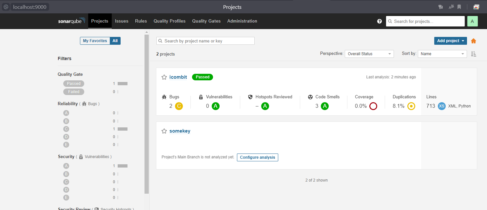

# 9.3. Процессы CI/CD

## Знакомоство с SonarQube

> Делаем скриншот успешного прохождения анализа, прикладываем к решению ДЗ
```
ilyapvd@matebook:/mnt/c/Netology/devops-netology$ sonar-scanner \
   -Dsonar.proj>    -Dsonar.projectKey=icombit \
>    -Dsonar.sources=. \
>    -Dsonar.host.url=http://localhost:9000 \
>    -Dsonar.coverage.exclusions=fail.py \
>    -Dsonar.login=ed2c47717e23e52f56fb9cfdfa5b4bb90000a298
INFO: Scanner configuration file: /var/lib/sonar-scanner-4.6.2.2472-linux/conf/sonar-scanner.properties
INFO: Project root configuration file: NONE
INFO: SonarScanner 4.6.2.2472
INFO: Java 11.0.11 AdoptOpenJDK (64-bit)
INFO: Linux 5.10.16.3-microsoft-standard-WSL2 amd64
INFO: User cache: /home/ilyapvd/.sonar/cache
INFO: Scanner configuration file: /var/lib/sonar-scanner-4.6.2.2472-linux/conf/sonar-scanner.properties
INFO: Project root configuration file: NONE
INFO: Analyzing on SonarQube server 8.7.1
INFO: Default locale: "en", source code encoding: "UTF-8" (analysis is platform dependent)
INFO: Load global settings
INFO: Load global settings (done) | time=146ms
INFO: Server id: BF41A1F2-AX8svMaFzb6rGz83_nL1
INFO: User cache: /home/ilyapvd/.sonar/cache
INFO: Load/download plugins
INFO: Load plugins index
INFO: Load plugins index (done) | time=100ms
INFO: Load/download plugins (done) | time=2840ms
INFO: Process project properties
INFO: Process project properties (done) | time=22ms
INFO: Execute project builders
INFO: Execute project builders (done) | time=2ms
INFO: Project key: icombit
INFO: Base dir: /mnt/c/Netology/devops-netology
INFO: Working dir: /mnt/c/Netology/devops-netology/.scannerwork
INFO: Load project settings for component key: 'icombit'
INFO: Load quality profiles
INFO: Load quality profiles (done) | time=98ms
INFO: Load active rules
INFO: Load active rules (done) | time=2455ms
INFO: Indexing files...
INFO: Project configuration:
INFO:   Excluded sources for coverage: fail.py
WARN: Thread[JGit-FileStoreAttributeReader-1,5,main]: got smaller file timestamp on /mnt/c (drvfs), /mnt/c/Netology/devops-netology/.git: 2022-02-24T17:28:49Z < 2022-02-24T17:28:49.689802Z. Aborting measurement at resolution PT0.310198S.
INFO: 152 files indexed
INFO: 0 files ignored because of scm ignore settings
INFO: Quality profile for py: Sonar way
INFO: Quality profile for xml: Sonar way
INFO: ------------- Run sensors on module icombit
INFO: Load metrics repository
INFO: Load metrics repository (done) | time=54ms
INFO: Sensor Python Sensor [python]
INFO: Starting global symbols computation
INFO: 3 source files to be analyzed
INFO: Load project repositories
INFO: Load project repositories (done) | time=9ms
INFO: 0/3 files analyzed, current file: 4.3/sr.py
INFO: Starting rules execution
INFO: 3/3 source files have been analyzed
INFO: 3 source files to be analyzed
INFO: Sensor Python Sensor [python] (done) | time=11421ms
INFO: 3/3 source files have been analyzed
INFO: Sensor Cobertura Sensor for Python coverage [python]
INFO: Sensor Cobertura Sensor for Python coverage [python] (done) | time=1895ms
INFO: Sensor PythonXUnitSensor [python]
INFO: Sensor PythonXUnitSensor [python] (done) | time=1661ms
INFO: Sensor CSS Rules [cssfamily]
INFO: No CSS, PHP, HTML or VueJS files are found in the project. CSS analysis is skipped.
INFO: Sensor CSS Rules [cssfamily] (done) | time=2ms
INFO: Sensor JaCoCo XML Report Importer [jacoco]
INFO: 'sonar.coverage.jacoco.xmlReportPaths' is not defined. Using default locations: target/site/jacoco/jacoco.xml,target/site/jacoco-it/jacoco.xml,build/reports/jacoco/test/jacocoTestReport.xml
INFO: No report imported, no coverage information will be imported by JaCoCo XML Report Importer
INFO: Sensor JaCoCo XML Report Importer [jacoco] (done) | time=8ms
INFO: Sensor C# Properties [csharp]
INFO: Sensor C# Properties [csharp] (done) | time=4ms
INFO: Sensor JavaXmlSensor [java]
INFO: 2 source files to be analyzed
INFO: Sensor JavaXmlSensor [java] (done) | time=406ms
INFO: Sensor HTML [web]
INFO: 2/2 source files have been analyzed
INFO: Sensor HTML [web] (done) | time=8ms
INFO: Sensor XML Sensor [xml]
INFO: 2 source files to be analyzed
INFO: Sensor XML Sensor [xml] (done) | time=309ms
INFO: Sensor VB.NET Properties [vbnet]
INFO: 2/2 source files have been analyzed
INFO: Sensor VB.NET Properties [vbnet] (done) | time=3ms
INFO: ------------- Run sensors on project
INFO: Sensor Zero Coverage Sensor
INFO: Sensor Zero Coverage Sensor (done) | time=236ms
INFO: SCM Publisher SCM provider for this project is: git
INFO: SCM Publisher 5 source files to be analyzed
INFO: SCM Publisher 4/5 source files have been analyzed (done) | time=725ms
WARN: Missing blame information for the following files:
WARN:   * fail.py
WARN: This may lead to missing/broken features in SonarQube
INFO: CPD Executor Calculating CPD for 3 files
INFO: CPD Executor CPD calculation finished (done) | time=35ms
INFO: Analysis report generated in 275ms, dir size=161 KB
INFO: Analysis report compressed in 1073ms, zip size=30 KB
INFO: Analysis report uploaded in 358ms
INFO: ANALYSIS SUCCESSFUL, you can browse http://localhost:9000/dashboard?id=icombit
INFO: Note that you will be able to access the updated dashboard once the server has processed the submitted analysis report
INFO: More about the report processing at http://localhost:9000/api/ce/task?id=AX8sx50bzb6rGz83_sLM
INFO: Analysis total time: 28.523 s
INFO: ------------------------------------------------------------------------
INFO: EXECUTION SUCCESS
INFO: ------------------------------------------------------------------------
INFO: Total time: 34.190s
INFO: Final Memory: 8M/44M
INFO: ------------------------------------------------------------------------
```



## Знакомство с Nexus

> В ответе присылаем файл maven-metadata.xml для этого артефекта

[maven-metadata.xml](maven-metadata.xml)


## Знакомство с Maven

> В ответе присылаем исправленный файл pom.xml

[pom.xml](pom.xml)